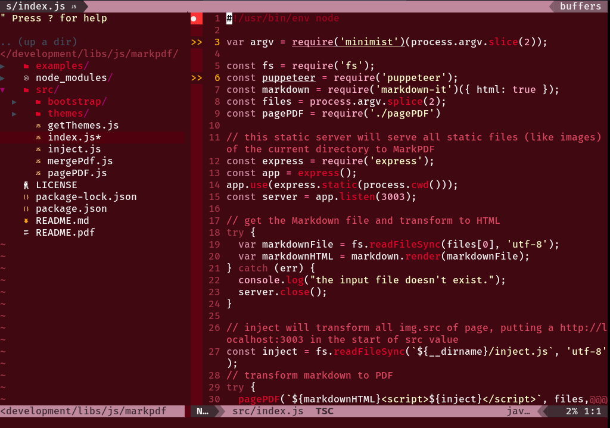

# Violenta

Violenta is a red/pink/purple/violenta color theme, with very hard colors. Use it if you don't have fear.



# Install

Install with your favorite Vim Plugin Manager, like, if you are using [Vim Plug](https://github.com/junegunn/vim-plug) you will need to put it to your Vim config file:

```viml
call plug#begin()

Plug 'edersonferreira/violenta-vim'

call plug#end()
```

And now, you can run:

```:color violenta```

And now, you are using Violenta Theme!
